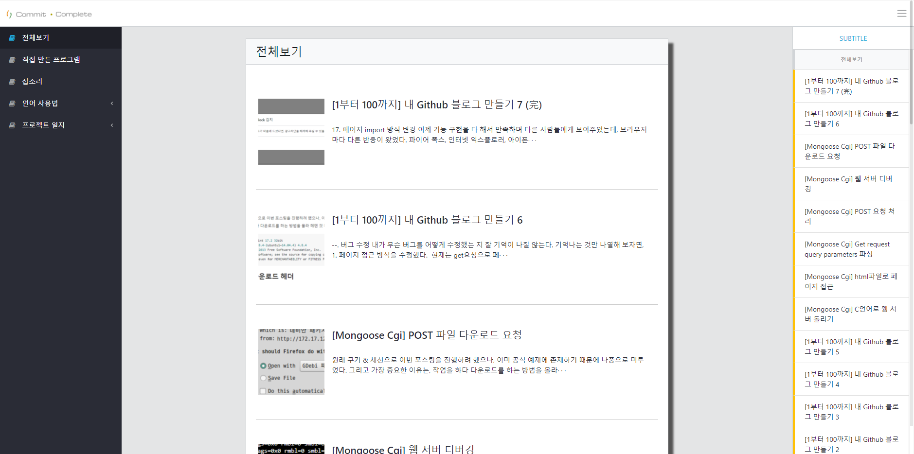
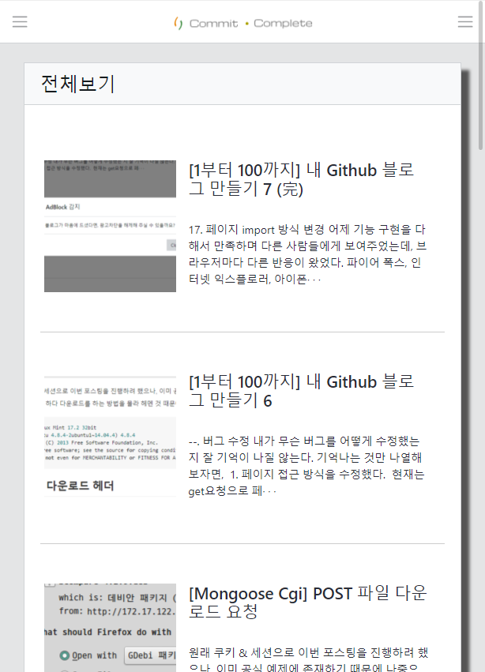
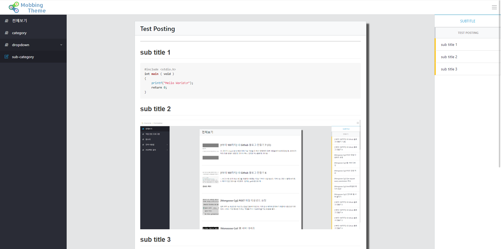

# Mobbing-Thema

## 주의
미리보기 사이트를 위하여 모든 URL 경로를 `/Mobbing-Theme/...` 으로 변경했습니다.
실제 사용하실 때는 `/` 으로 변경해서 사용해 주세요.

## 미리 보기

[Preview Site](https://mobbing.github.io/Mobbing-Theme/)





<br>

## UI 라이브러리

다음 UI 템플릿을 사용했습니다.
#### [coreui.io](https://coreui.io)

해당 템플릿의 사용법은 다음 주소에서 볼 수 있습니다.
#### [coreui document](https://coreui.io/docs/getting-started/introduction/)

## 다운로드 및 디버깅
```console
$ git clone https://github.com/mobbing/mobbing.github.io.git
$ cd mobbing.github.io
$ npm install
$ npm start
```

express를 사용하는 서버가 간단하게 구축되어 있습니다.
localhost:3000 으로 접속하여 개발중인 사이트를 테스트해볼 수 있습니다.

## 트리
```none
Mobbing-Theme
├─posts
│  ├─category
│  ├─dropdown
│  └─posts.js
└─resource
   ├─css
   ├─img
   └─js
```

posts : 포스팅 내용이 저장됩니다.<br>
resource : 포스팅과 관련되지 않은 블로그를 꾸밀 때 사용하는 리소스들을 담습니다.

## 포스팅
**/posts/** 에서 모든 포스팅을 관리합니다.<br>
posts.js를 수정하고, 포스팅이 관리 될 카테고리 폴더를 생성하고, 포스트가 들어갈 폴더를 생성해 index.html을 만들면 됩니다.

하지만 이 모든 것을 하나씩 일일히 추가한다는 것은 실수가 있을 지도 모르고, html을 직접 사용하여 포스팅 하는 것은 시간이 오래걸립니다.

그래서 Markdown을 사용하여 효율적인 생산성과 포스팅의 간편화를 지원해주는 프로그램을, 오픈 소스인 **[Moeditor](https://github.com/Moeditor/Moeditor)** 를 수정하여 만들었습니다.

자세한 사용법은 해당 깃 레포지토리를 방문 해 확인하세요.

#### [Mobbing/Moeditor](https://github.com/mobbing/Moeditor)

<br>

## 사이트 맵

Mobbing-Theme는 온라인 사이트맵 프로그램이 제대로 된 사이트맵을 만들어 주지 않습니다. 그래서 우리의 사이트맵을 만들어주는 스크립트를 작성했습니다.

```console
$ node make_sitemap.js
```
프로젝트 최상위 폴더에 스크립트가 있습니다. 실행시키면 포스팅한 모든 내용들이 같은 폴더에 사이트맵으로 추출됩니다. 

